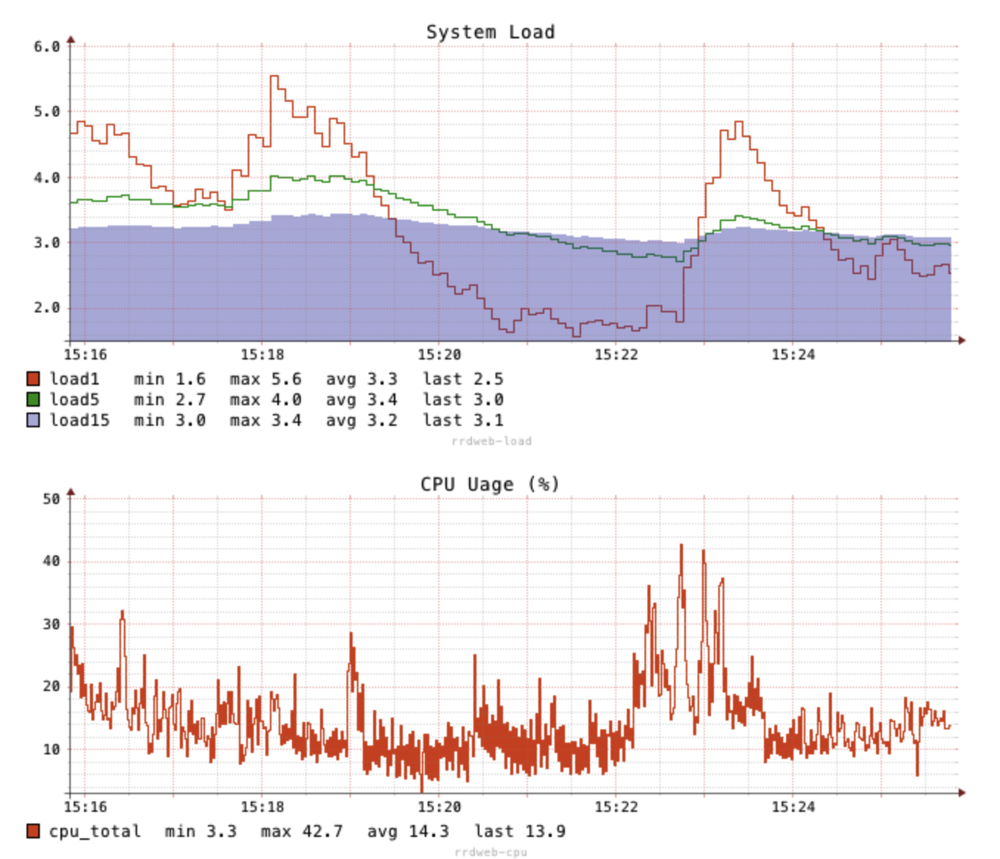

# TINE

[](https://github.com/OutOfBedlam/tine/releases)

[](https://codecov.io/gh/OutOfBedlam/tine)


TINE a data pipeline runner.

## Install

```bash
go install github.com/OutOfBedlam/tine@latest
```

Find documents from [https://tine.thingsme.xyz/](https://tine.thingsme.xyz/)

## Usage

### Define pipeline in TOML

Set the pipeline's inputs and outputs.

```toml
[[inlets.cpu]]
    interval = "3s"
[[flows.select]]
    includes = ["#*", "*"]  # all tags and all fields
[[outlets.file]]
    path  = "-"
    decimal = 2
```

### Run

```bash
tine run <config.toml>
```

It generates CPU usage in CSV format which is default format of 'outlets.file'.

```
1721635296,cpu,1.57
1721635299,cpu,0.66
1721635302,cpu,1.07
1721635305,cpu,2.08
```

Change output format to "json" from "csv", add `format = "json"` at the end of the file.

```toml
[[outlets.file]]
    path  = "-"
    format = "json"
    decimal = 2
```

```json
{"_in":"cpu","_ts":1721780188,"total_percent":0.91}
{"_in":"cpu","_ts":1721780191,"total_percent":1.04}
{"_in":"cpu","_ts":1721780194,"total_percent":0.25}
{"_in":"cpu","_ts":1721780197,"total_percent":1.20}
```

### Shebang

1. Save this file as `load.toml`

```toml
#!/path/to/tine run
[[inlets.load]]
    loads = [1, 5]
    interval = "3s"
[[flows.select]]
    includes = ["**"]  # equivalent to ["#*", "*"]
[[outlets.file]]
    path  = "-"
    decimal = 2
```

2. Chmod for executable.

```sh
chmod +x load.toml
```

3. Run

```sh
$ ./load.toml

1721635438,load,0.03,0.08
1721635441,load,0.03,0.08
1721635444,load,0.03,0.08
^C
```

## Embed in your program

Create an pipeline and add inlets and outlets.

See the full code from the directory [./example/custom_in](./example/custom_in/custom_in.go).

**Create a pipeline**

```go
pipeline, err := engine.New(engine.WithName("my_pipeline"))
```

**Set inputs of the pipeline**

```go
// Add inlet for cpu usage
conf := engine.NewConfig().Set("percpu", false).Set("interval", 3 * time.Second)
pipeline.AddInlet("cpu", psutil.CpuInlet(pipeline.Context().WithConfig(conf)))
```

**Set outputs of the pipeline**

```go
// Add outlet printing to stdout '-'
conf = engine.NewConfig().Set("path", "-").Set("decimal", 2)
pipeline.AddOutlet("file", file.FileOutlet(pipeline.Context().WithConfig(conf)))
```

**Run the pipeline**

```
go pipeline.Start()
```

Run this program, it shows the output like ...

```
1721510209,custom,random,43.01
1721510209,cpu,7.93
1721510212,custom,random,25.14
1721510212,cpu,7.35
1721510215,custom,random,83.24
1721510215,cpu,7.14
```

## Examples

**How to use TINE as a library for your application.**

- [helloworld](./example/helloworld/helloworld.go)

**How to set a custom inlet/outlet/flows.**

- [custom_out](./example/custom_out/custom_out.go)
- [custom_in](./example/custom_in/custom_in.go)
- [custom_flow](./example/custom_flow/custom_flow.go)
- [custom_out_reg](./example/custom_out_reg/custom_out_reg.go)
- [custom_in_reg](./example/custom_in_reg/custom_in_reg.go)
- [custom_flow_reg](./example/custom_flow_reg/custom_flow_reg.go)

**How to use pipelines as a HTTP handler**

- [httpsvr](./example/httpsvr/httpsvr.go)


**How to collect metrics into RRD and display rrdgraph in a web page**

- [rrd_graph_web](./example/rrd_graph_web/rrd_graph_web.go)



**How to collect metrics into Sqlite and display it on web page**

This example also shows how to utilize HTTP query parameters 
as variables of Go Templates to build pipeline configuration.

- [sqlite_graph_web](./example/sqlite_graph_web/sqlite_graph_web.go)

## Documents

Please visit [https://tine.thingsme.xyz](https://tine.thingsme.xyz) for the documents.
