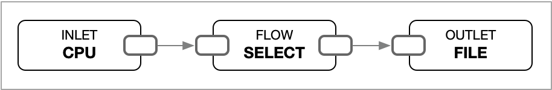

# Concept

### Pipeline

A pipeline is a series of steps or processes that are used to extract, transform, and load (ETL) data from one or more sources to one or more destinations. It is a common concept in data engineering and is used to automate the movement and transformation of data.

A pipeline consists of multiple inlets, flows and outlets.

**Inlets**: The first step in a data pipeline is to extract/retrieve data from various sources such as databases, APIs, files, or streaming platforms. This can involve querying databases, making API requests, or reading files by using the proper inlets.

**Flows**: Once the data is retrieved, it often needs to be transformed or cleaned to make it suitable for analysis or destinations. This can involve tasks like filtering, aggregating, joining, or applying calculations to the data. Data transformation can be done using various flows. In some cases, additional processing or analysis may be required on the transformed data. This can involve running machine learning algorithms, performing statistical analysis, or generating reports.

**Outlets**: After the data is transformed, it needs to be exported/passed to a destination such as external system, a database, or a file system. This step involves writing the transformed data to the destination in a structured format.

<figure><figcaption><p>A simple pipeline</p></figcaption></figure>

```toml
[[inlets.cpu]]
    interval = "3s"
[[flows.select]]
    includes = ["**"]
[[outlets.file]]
    path  = "-"
```

The example above is extracting data of system's CPU usage by `inlets.cpu` and pass it to `flows.select` which is simply pass to the only outlet `outlets.file` that configured to print out on stdout.

### Record

The data passing through a pipeline is a stream of records.  A record has one or more fields and zero or more tags.

### Field

A field is name and value pair and it can have zero or more tags.

### Tag

A record can have zero or more tags.

Tag is name and value pair which is similar to Field but tag is just auxiliary data.

### Value

A Value represents the smallest unit of values.

