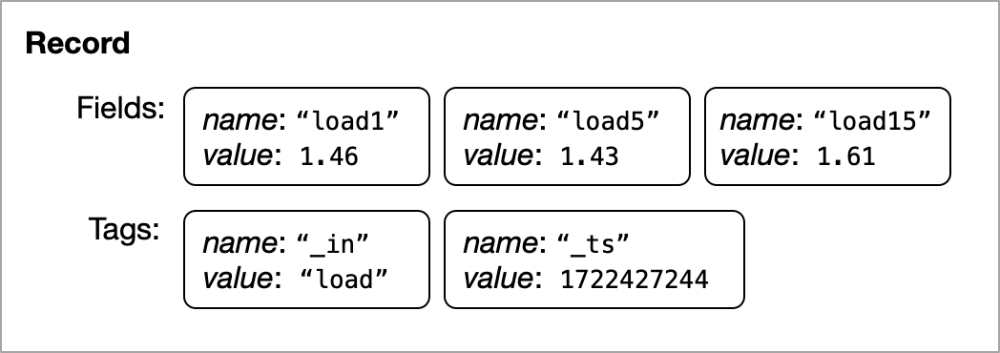

# Concept

### Pipeline

A pipeline consists of multiple inlets, flows and outlets.

A pipeline is a series of steps or processes that are used to extract, transform, and load (ETL) data from one or more sources to one or more destinations. It is a common concept in data engineering and is used to automate the movement and transformation of data.

Here's an example of how a data pipeline works:

**Inlets**: The first step in a data pipeline is to extract or retrieve data from various sources such as databases, APIs, files, or streaming platforms. This can involve querying databases, making API requests, or reading files by using the appropriate inlets.

**Flows**: Once the data is retrieved, it often needs to be transformed or cleaned to make it suitable for analysis or destinations. This can involve tasks like filtering, aggregating, joining, or applying calculations to the data. Data transformation can be done using various flows. In some cases, additional processing or analysis may be required on the transformed data. This can involve running machine learning algorithms, performing statistical analysis, or generating reports.

**Outlets**: After the data is transformed, it needs to be exported/passed to a destination such as external system, a database, or a file system. This step involves writing the transformed data to the destination in a structured format.

```toml
[[inlets.cpu]]
    interval = "3s"
[[flows.select]]
    includes = ["**"]
[[outlets.file]]
```

<figure><figcaption><p>A simple pipeline</p></figcaption></figure>

The example above is extracting data of system's CPU usage by `inlets.cpu` and pass it to `flows.select` which is simply pass to the only outlet `outlets.file` that configured to print out on stdout.

### Record

The data flowing through a pipeline consists of a sequence of records. Each record contains one or more fields and may have zero or more tags. For instance, in the given pipeline definition, the `inlets.load` component retrieves the average system load for 1 minute, 5 minutes, and 15 minutes, and passes this information as a record every 3 seconds to the next component.

```toml
[[inlets.load]]
    interval = "3s"
    loads = [1, 5, 15]
[[outlets.file]]
    decimal = 2
```

The result of this pipeline might be similar to the following.

```csv
1.46,1.43,1.61
1.55,1.45,1.62
1.51,1.44,1.61
...
```

The first line of the result can be visualized in the following diagram.

<figure><figcaption><p>A record</p></figcaption></figure>

The first record has three fields named `load1`, `load5`, and `load15`. The two tags `_in` that informs which inlet makes the data, and `_ts` (timestamp) which shows when the data is captured, are not exported into the result because tags are hidden from the final result by default.

To include tags in the result, you can use the `flows.select` expression with `includes = ["**"]`. This expression selects which fields can be passed to the next step and converts specified tags, indicated by `#tag_name`, into fields. In the example below, the `**` notation is used to include all tags and fields.

```toml
[[inlets.load]]
    interval = "3s"
    loads = [1, 5, 15]
[[flows.select]]
    includes = ["**"]
[[outlets.file]]
    path  = "-"
    decimal = 2
```

The pipeline generates the result might be like below.

```csv
load,1722427244,1.87,1.93,1.83
load,1722427247,1.87,1.93,1.83
load,1722427250,1.80,1.91,1.83
```

The first column "load" came from the value of `_in` tag followed by `_ts` tag's value and all other fields in order.

To make the result clearer, change the output format to "json".

```toml
[[inlets.load]]
    interval = "3s"
    loads = [1, 5, 15]
[[flows.select]]
    includes = ["**"]
[[outlets.file]]
    format = "json"
    decimal = 2
```


```json
{"_in":"load","_ts":1722428243,"load1":1.65,"load15":1.62,"load5":1.65}
{"_in":"load","_ts":1722428246,"load1":1.60,"load15":1.61,"load5":1.64}
{"_in":"load","_ts":1722428249,"load1":1.60,"load15":1.61,"load5":1.64}
```


### Field

A field is a name and value pair and can have zero or more tags. The tags of a field are independent of the record-level tags.

### Tag

A record and a field can have zero or more tags.

Tag is name and value pair which is similar to fields but tags are auxiliary data.

### Value

A "value" represents the unit of an actual value. The field and tag have its own value. Each value have specific type.

The available value types:

* BOOL boolean type (true or false)
* INT 64bits signed integer
* UINT 64bits unsigned integer
* FLOAT 64bits floating point
* STRING UTF-8 text
* TIME date and time in nano seconds
* BINARY a chunk of bytes

