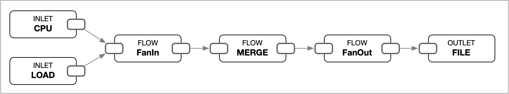

# Merge Records

Generally, we want to observe the CPU usage and load average in a record at the same time. The following example demonstrates each inlet yielding its records, and the outlet printing them out individually in order.

```toml
[[inlets.cpu]]
    percpu = false
    interval = "1s"
    count = 3
[[inlets.load]]
    loads = [1, 5]
    interval = "1s"
    count = 2
[[outlets.file]]
    path = "-"
    format = "json"
    decimal = 2
```

```json
{"load1":2.14,"load5":2.11}
{"total_percent":8.16}
{"total_percent":11.97}
{"load1":2.05,"load5":2.09}
{"total_percent":12.26}
```

Let's enhance the pipeline by introducing the `[[flows.merge]]`. This flow allows us to merge multiple records into a single record based on their `_ts` tag. The resulting record will be a combination of the merged records.

```toml
[[inlets.cpu]]
    percpu = false
    interval = "1s"
    count = 3
[[inlets.load]]
    loads = [1, 5]
    interval = "1s"
    count = 2
[[flows.merge]]
    wait_limit = "1s"
[[outlets.file]]
    path = "-"
    format = "json"
    decimal = 2
```

<figure><figcaption><p>A pipeline with multiple inlets and merge</p></figcaption></figure>

```json
{"_ts":1723255081,"cpu.total_percent":8.16,"load.load1":1.80,"load.load5":2.00}
{"_ts":1723255082,"cpu.total_percent":17.14,"load.load1":1.81,"load.load5":2.00}
{"_ts":1723255083,"cpu.total_percent":13.33}
```

`[[flows.merge]]` promotes the `_ts` tag to a field that has same name `_ts` and renames all other fields with the origin `_in` tag value followed by a dot and the original name. This operation is conceptually similar to joining tables in a relational database management system (RDBMS). It can be thought of as performing a query:

```sql
SELECT
    _ts, cpu.total_usage, load.load1, load.load5
FROM
    cpu,
    load
WHERE
    cpu._ts = load._ts
```
