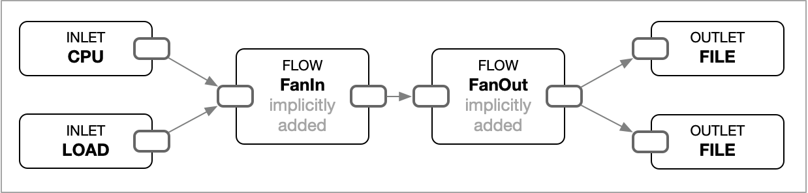

# Multiple Inlets and Outlets

A pipeline may have multiple inlets and outlets.

<figure><figcaption><p>A pipeline with multiple inlets and outlets</p></figcaption></figure>

The example below shows a simple example.

```toml
[[inlets.cpu]]
    percpu = false
    interval = "1s"
    count = 3
[[inlets.load]]
    loads = [1, 5]
    interval = "1s"
    count = 2
[[outlets.file]]
    path = "-"
    format = "json"
    decimal = 2
[[outlets.file]]
    path = "-"
    format = "csv"
    decimal = 2
```

If you run this pipeline, it will print out the cpu usage and load average in CSV and JSON format.

```sh
$ tine run example.toml

2.19,3.45
{"load1":2.19,"load5":3.45}
{"total_percent":8.16}
8.16
{"load1":2.19,"load5":3.45}
{"total_percent":4.73}
2.19,3.45
4.73
2.62
{"total_percent":2.62}
```
