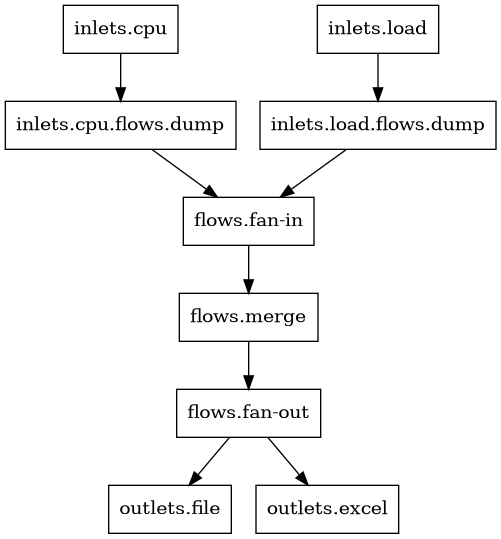

# Graph pipeline

The `graph` command is a powerful tool that generates a dot expression, allowing for the visualization of the pipeline in a clear and concise manner. This visualization can greatly enhance the understanding and analysis of the pipeline's structure and flow.

```sh
tine graph <pipeline.toml> -o - | dot -Tpng -o./graph-pipeline.png
```

<figure><figcaption><p>graph-pipeline.png</p></figcaption></figure>