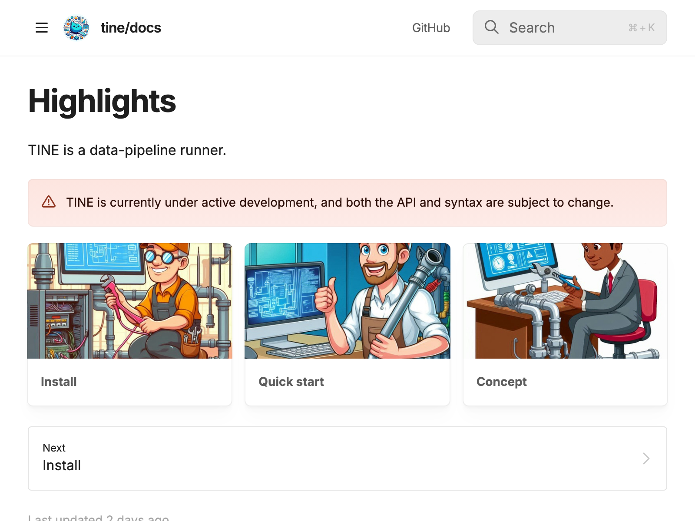
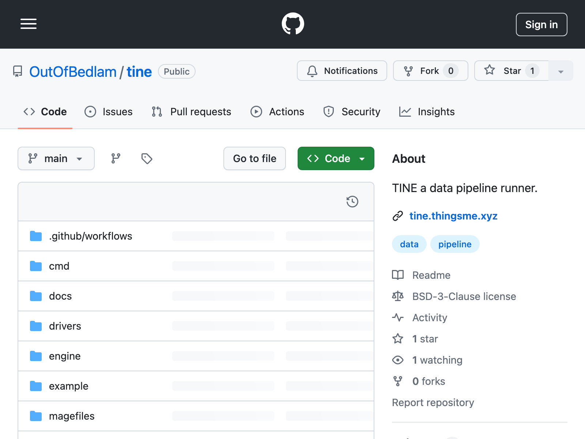

# Web Page Screenshot with Headless Chrome


The `chrome_snap` plugin requires TINE to be built with the `-tags chrome` flag and relies on having Google Chrome browser installed beforehand.


The following recipe captures two web pages and saves them as image files.

### Code

```toml
#[log]
#    path = "-"
#    level = "debug"
[[inlets.file]]
    data = [
        '{"url":"https://tine.thingsme.xyz", "dst_path":"./chrome_snap_tine_docs.png"}', 
        '{"url":"https://github.com/OutOfBedlam/tine", "dst_path":"./chrome_snap_tine_github.png"}', 
    ]
    format = "json"
[[flows.chrome_snap]]
    url_field = "url"
    out_field = "snap"
    timeout = "15s"
[[outlets.image]]
    path_field = "dst_path"
    image_fields = ["snap"]
    overwrite = true
```

### Run

Build TINE with `-tags chrome` and run it with the recipe file.

```sh
$ go build -tags chrome

$ ./tine run ./example.toml
```

Or, run direct from source code.

```sh
$ go run -tags chrome . run ./example.toml
```

### Output

<figure><figcaption><p>chrome_snap_tine_docs.png</p></figcaption></figure>

<figure><figcaption><p>chrome_snap_tine_github.png</p></figcaption></figure>