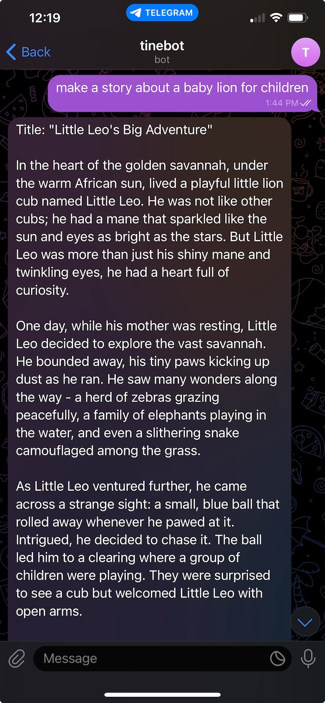

# Chatbot Telegram with OLLAMA

Create Telegram chat bot with OLLAMA

### Generates text responses via OLLAMA from user's message.

> Replace `_YOUR_TELEGRAM_BOT_TOKEN_`, `_OLLAMA_HOST_`, and `_OLLAMA_PORT_` from the below example with yours.
> And the "model" parameter of flows.ollama should be pulled in advance.

**chatbot.toml**
```toml
[log]
    level = "info"

[[inlets.telegram]]
    token = "_YOUR_TELEGRAM_BOT_TOKEN_"
    debug = false
    timeout = "1s"

## inlets.telegram set the "text" field for the received message,
## change the field name from "text" to "prompt" which is expected by flows.ollama
## inlets.telegram set the "photo" field for the image file attached  in the message.
## change the field name from "photo" to "image" which is expected by flows.ollama
[[flows.update]]
    set = [
        { field = "text", name = "prompt" },
        { field = "photo", name = "image" },
    ]

[[flows.ollama]]
    address = "http://_OLLAMA_HOST_:_OLLAMA_PORT_"
    timeout = "120s"
    model = "phi3"
    stream = false

## flows.ollama yield a record that has "response" field for the result
## outlets.telegram is expecting "text" for outgoing message.
[[flows.update]]
    set = [
        { field = "response", name = "text"}
    ]

[[outlets.telegram]]
    token = "_YOUR_TELEGRAM_BOT_TOKEN_"
```

**Telegram**

<figure><figcaption><p>Telegram Chat Bot with OLLAMA</p></figcaption></figure>
