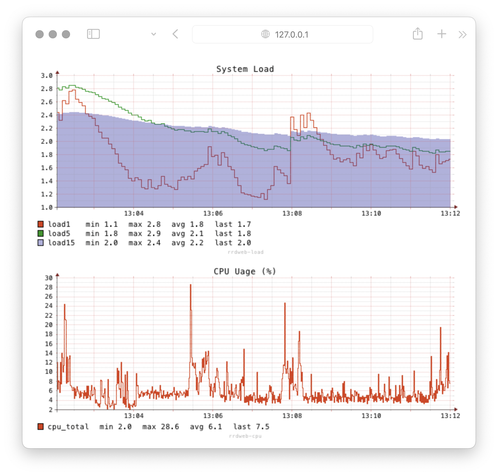

# RRD


rrd plugins requires Tine to be built with `-tags rrd` which need `librrd-dev` package to be installed in advance.


## Example Web + RRD

Let's make a example application that collects CPU usage and system load average, saves the data into RRD, serves web page shows the collected data as graph.

This code starts a simple web server that serves at `http://127.0.0.1:8080` with three endpoints `/`, `/graph/load`, and `/graph/cpu`.

### Code

Please find the full source from the [github repository](https://github.com/OutOfBedlam/tine/tree/main/example/rrd_graph_web).

```go
package main

import (
	"fmt"
	"net/http"

	"github.com/OutOfBedlam/tine/engine"
	_ "github.com/OutOfBedlam/tine/plugin/all"
	_ "github.com/OutOfBedlam/tine/x/rrd"
)

func main() {
	addr := "127.0.0.1:8080"
	// start data collector that save metrics to rrd file
	collect, _ := engine.New(engine.WithConfig(collectorPipeline))
	collect.Start()

	router := http.NewServeMux()
	router.HandleFunc("GET /", getView)
	router.HandleFunc("GET /graph/load", HttpHandler(graphLoadPipeline))
	router.HandleFunc("GET /graph/cpu", HttpHandler(graphCpuPipeline))
	fmt.Printf("\nlistener start at http://%s\n", addr)
	http.ListenAndServe(addr, router)

	// stop data collector
	collect.Stop()
}
```

### Run

Create this code as `rrd_graph_web.go` and run with `-tags rrd` build flags.

```sh
go run --tags rrd ./rrd_graph_web.go
```

Then open web browser, it will shows the system's load average and cpu usage in graphs.

<figure><figcaption><p>RRDGraph</p></figcaption></figure>


### How this works

#### Start collecting pipeline

Make a pipeline that collecting CPU usage and load average and merge them into a record then writing on the RRD file.

```go
collect, _ := engine.New(engine.WithConfig(collectorPipeline))
collect.Start()
...omit...
collect.Stop()
```

The `collectorPipeline` is defined as:

```toml
name = "rrd-collector"
[defaults]
	interval = "1s"
[[inlets.load]]
[[inlets.cpu]]
	percpu = false
	totalcpu = true
[[flows.merge]]
	wait_limit = "2s"
[[outlets.rrd]]
	path = "./tmp/rrdweb.rrd"
	step = "1s"
	heartbeat = "2s"
	fields = [
		{ field="load.load1", ds="load1", dst="GAUGE", min=0.0, max="U" },
		{ field="load.load5", ds="load5", dst="GAUGE", min=0.0, max="U" },
		{ field="load.load15", ds="load15", dst="GAUGE", min=0.0, max="U" },
		{ field="cpu.total_percent", ds="cpu_total", dst="GAUGE", min=0.0, max="U" },		 
    ]
	rra = [
        { cf = "AVERAGE", steps = "1s", rows="3h" },
        { cf = "AVERAGE", steps = "1m", rows="3d" },
        { cf = "AVERAGE", steps = "1h", rows="30d" },
        { cf = "AVERAGE", steps = "1d", rows="13M" },
	]
```


#### Rendering HTML

Attach `getView` handler on the `/` endpoint.
```go
	router.HandleFunc("GET /", getView)
```

The `getView()` handler embeds two `` elements that runs on endpoints, `/graph/load` and `/graph/cpu`, and reloads them every 2 seconds.

```go
func getView(w http.ResponseWriter, r *http.Request) {
	w.Header().Set("Content-Type", "text/html")
	w.Write([]byte(`<html>
		<body>
            
            
		</body>
		<script type="text/javascript">
			function refresh_load_graph() {
				document.getElementById('rrd_load').src = '/graph/load?t=' + new Date().getTime();
			}
			setInterval(refresh_load_graph, 2000);

			function refresh_cpu_graph() {
				document.getElementById('rrd_cpu').src = '/graph/cpu?t=' + new Date().getTime();
			}
			setInterval(refresh_cpu_graph, 2000);
		</script>
	</html>`))
}
```

#### HttpHandler wrapper for a pipeline

Running a pipeline as a HTTP Handler requires preparation, the below `HttpHandler()` code shows how to wrap your pipeline for a handle.

```go
func HttpHandler(config string) http.HandlerFunc {
	return func(w http.ResponseWriter, r *http.Request) {
		p, _ := engine.New(
			engine.WithConfig(config),
			engine.WithWriter(w),
		)
		if err := p.Run(); err != nil {
			http.Error(w, err.Error(), http.StatusInternalServerError)
			return
		}
		p.Stop()
	}
}
```

#### Attach pipelines to the endpoints

```go
	router.HandleFunc("GET /graph/load", HttpHandler(graphLoadPipeline))
	router.HandleFunc("GET /graph/cpu", HttpHandler(graphCpuPipeline))
```

The pipeline definitions of `graphLoadPipeline` and `graphCpuPipeline` are:

**graphLoadPipeline**

```toml
name = "rrdweb-load"
[[inlets.rrd_graph]]
	path = "./tmp/rrdweb.rrd"
	count = 1
	title = "System Load"
	range = "10m"
	size = [600, 200]
	theme = "gchart2"
	fields = [
		{ ds = "load1", cf="AVERAGE", type="line", name="%-6s", min="%3.1lf", max="%3.1lf", avg="%3.1lf", last="%3.1lf\\n"},
		{ ds = "load5", cf="AVERAGE", type="line", name="%-6s", min="%3.1lf", max="%3.1lf", avg="%3.1lf", last="%3.1lf\\n"},
		{ ds = "load15", cf="AVERAGE", type="area", name="%-6s", min="%3.1lf", max="%3.1lf", avg="%3.1lf", last="%3.1lf\\n"},
	]
[[outlets.image]]
	path = "nonamed.png"
```

**graphCpuPipeline**

```toml
name = "rrdweb-cpu"
[[inlets.rrd_graph]]
	path = "./tmp/rrdweb.rrd"
	count = 1
	title = "CPU Usage (%)"
	range = "10m"
	size = [600, 200]
	theme = "gchart2"
	fields = [
		{ ds = "cpu_total", cf="AVERAGE", type="line", name="%-6s", min="%3.1lf", max="%3.1lf", avg="%3.1lf", last="%3.1lf\\n"},
	]
[[outlets.image]]
	path = "nonamed.png"
```

## Save data into RRD

**rrd_out.toml**

```toml
[[inlets.load]]
    loads = [1, 5, 15]

[[outlets.rrd]]
    ## RRD database file path
    path = "./tmp/rrd_out.rrd"
    ## Overwrite the file if it already exists
    overwrite = false
    ## Input data interval (minimum is 1s)
    step = "1s"
    ## default heartbeat that will be used for all data sources
    heartbeat = "2s"
    ## which time field to use for the data source (default is "_ts")
    time_field = "_ts"
    ## field field to map to the data source
    ## ds    Data Source Name (if not specified, field name will be used)
    ##       If ds contains invalid characters for RRD(e.g. ':'), it will be replaced with "_"
    ## dst   Data Source Type
    ##       GAUGE, COUNTER, DCOUNTER, DERIVE, DDERIVE, ABSOLUTE, COMPUTE
    ## heartbeat should be larger than step
    ## min   minimum value, "U" means unknown,
    ##       if input value is less than min, it will be treated as unknown
    ## max   maximum value, "U" means unknown,
    ##       if input value is greater than max, it will be treated as unknown
    ## rpn   Reverse Polish Notation expression
    fields = [
        { field="load1",  dst="GAUGE", heartbeat="2s", min=0.0, max="U", rpn="" },
        { field="load5",  dst="GAUGE", heartbeat="2s", min=0.0, max="U", rpn="" },
        { field="load15", dst="GAUGE", heartbeat="2s", min=0.0, max="U", rpn="" },
    ]

    ## Round Robin Archive
    ##
    ## cf    consolidation function
    ##       AVERAGE, MIN, MAX, LAST
    ## xxf   xfiles factor, how long to consider data as known when unknown data comes in.
    ##       It's a value between 0 and 1, with the default being 0.5.
    ##       For example, if xff is set to 0.5 and 50% of the data points are known (1, unknown, unknown, 1),
    ##       the average will be 1. If 75% of the data points are unknown (1, unknown, unknown, unknown),
    ##       the result will be unknown.
    ## steps how many steps to use for calculation of this RRA
    ##       1 means every data point is used which is equal to the 'LAST' function
    ## rows  how many rows to store in this RRA
    rra = [
        { cf = "AVERAGE", steps = "1s", rows="3h" },
        { cf = "AVERAGE", steps = "1m", rows="3d" },
        { cf = "AVERAGE", steps = "1h", rows="30d" },
        { cf = "AVERAGE", steps = "1d", rows="13M" },
    ]
```

## Graph from RRD

```toml
[[inlets.rrd_graph]]
    interval = "1s"
    range = "15m"
    title = "Test Graph"
    size = [450,130]
    units_length = 5
    v_label = "Load"
    theme = "gchart2"
    zoom = 1.5
    border = 0
    units_exponent = 0
    path = "./tmp/test.rrd"
    fields = [
        { ds = "load1", cf="AVERAGE", type="line", min="%3.1lf", max="%3.1lf", avg="%3.1lf", last="%3.1lf\\n" },
        { ds = "load5", cf="AVERAGE", type="line", min="%3.1lf", max="%3.1lf", avg="%3.1lf", last="%3.1lf\\n"},
        { ds = "load15", cf="AVERAGE", type="area", min="%3.1lf", max="%3.1lf", avg="%3.1lf", last="%3.1lf\\n"},
    ]

[[outlets.image]]
    path = "./tmp/rrd.png"
    overwrite = true
```