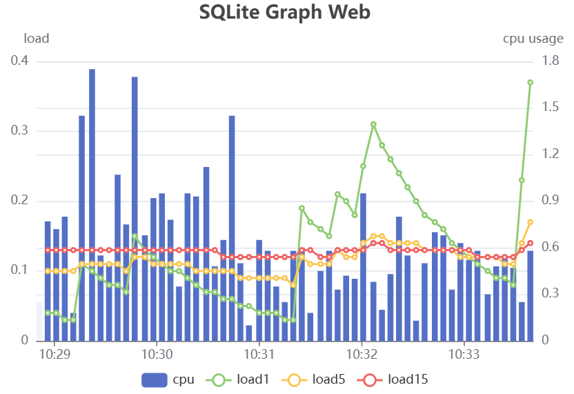

# SQLite

This recipe demonstrates how to utilize SQLite as a storage solution for collecting data.
It not only stores the data efficiently but also enables the generation of insightful charts based on the stored information.

<figure><figcaption><p>SQLite Graph Web</p></figcaption></figure>

## Web Server

Create a data collecting pipeline and web server that generate charts using another pipeline.

```go
func main() {
	addr := "127.0.0.1:8080"
	// start data collector that save metrics to sqlite
	collect, _ := engine.New(engine.WithConfig(collectorPipeline))
	collect.Start()

	router := http.NewServeMux()
	router.HandleFunc("GET /", getView)
	router.HandleFunc("GET /query", HttpHandler(queryPipeline))
	fmt.Printf("\nlistener start at http://%s\n", addr)
	http.ListenAndServe(addr, router)

	// stop data collector
	collect.Stop()
}
```

We define the `collectorPipeline` and `queryPipeline`, as well as an HTML view.

**collectorPIpeline**

```toml
name = "collector"
[[inlets.load]]
	loads = [1, 5, 15]
	interval = "5s"
[[inlets.cpu]]
	percpu = false
	totalcpu = true
	interval = "5s"
[[flows.merge]]
	wait_limit = "2.5s"
[[outlets.sqlite]]
	path = "file::memdb?mode=memory&cache=shared"
	inits = [
		"""CREATE TABLE test (
			time INTEGER,
			cpu REAL,
			load1 REAL,
			load5 REAL,
			load15 REAL,
			UNIQUE(time)
		)""",
	]
	actions = [
		["""INSERT INTO test (time, cpu, load1, load5, load15) 
			VALUES (?, ?, ?, ?, ?)""", 
			"_ts", "cpu_total_percent", "load_load1", "load_load5", "load_load15"],
		["""DELETE FROM test WHERE datetime(time, 'unixepoch') < datetime('now', '-60 minutes')"""],
	]
```

**queryPipeline**

```toml
name = "query"
[[inlets.sqlite]]
	count = 1
	path = "file::memdb?mode=memory&cache=shared"
    actions = [
        ['''SELECT time, cpu, load1, load5, load15 
			FROM test
			WHERE
				datetime(time, 'unixepoch') > datetime('now', '-5 minutes')
			ORDER BY time
		'''],
    ]
[[outlets.template]]
	content_type = "application/json"
	column_series = "json"
	lazy = true
	decimal = 2
	templates = ['{ "time":{{ .time }}, "cpu":{{ .cpu }}, "load1":{{ .load1 }}, "load5":{{ .load5 }}, "load15":{{ .load15 }} }']
```

Please refer the example [here](https://github.com/OutOfBedlam/tine/tree/main/example/sqlite_graph_web) for the full source code.

